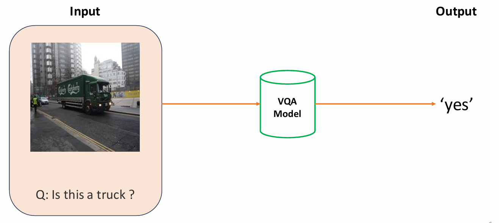
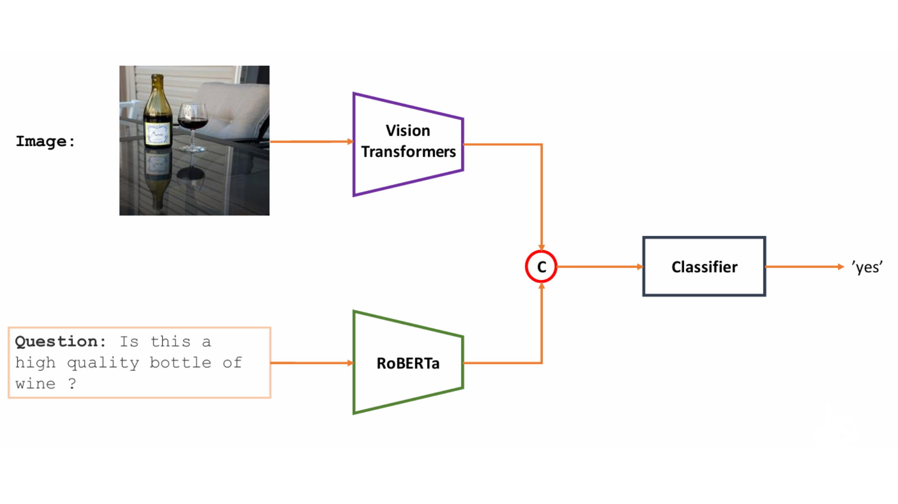

# Visual Question Answering Model
## Introduction 
input an image and a yes/no question and the model will output the answer to the question.

## Model Architecture
This model using ViTModel model for image feature extraction and BERT model for text feature extraction. the output of the two models is concatenated and passed through a classifier to get the answer.

## Technologies
- Pytorch
- Torchtext
- Transformers(ViTImageProcessor and RobertaModel)
- PIL
- Spacy

You can find my trained model [here](https://drive.google.com/file/d/1SLeqmiqt3omQabsWchjFLsELC0HGJo-S/view?usp=sharing)